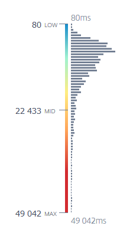
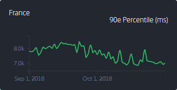
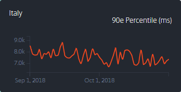
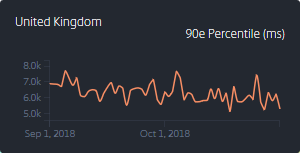
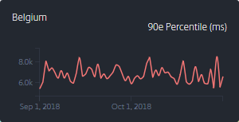
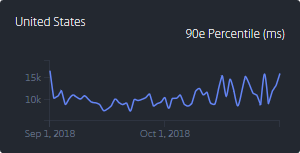
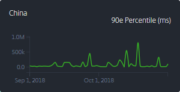

# Front-End

There is much to discuss here, but the main idea is to adhere to progressive enhancement in all things. Start small and iterate, then add to your build as time and browser support allow.

## Protocol

One big improvement was HTTP/2, in that we don’t have to bundle our CSS and JS files to serve them with 1 request each.

Indeed, bundling files was an optimization of the network stack, when browsers needed to do one round-trip request and response call for every resource.

Before HTTP/2, the browser needed to request every asset over the network, and there was usually a limit of 6 concurrent resources per domain. However with the increase in complexity in recent years, websites have needed to include more and more CSS and JS files to be rendered properly. This meant that browser limits were reached (simultaneous downloads per domain), and the network stack began to slow down webpage rendering. To avoid this issue, developers started merging their assets into bigger CSS and JS files, bundles that were built for each page and served to the browser. But now the browser caching rules were inefficiently used, since the same libs were bundled under different URLs depending on the page that was served. There was no good solution.

Since HTTP/2, web pages only need reference their individual dependencies and let the software (browser + server) optimize the network calls. This makes it much simpler for everyone involved. HTTP/2 allows servers to send all the resources in one network stream, so the round-trip bottleneck is less of an issue. We can serve just the assets needed for the current page, and use efficient caching rules for each asset so the browser can decide whether each asset warrants a network call.

The one aspect of this protocol we have tried but that didn’t work out like expected, was Server Push. Since browsers used to send uncredentiated requests, which means no “Accept” request headers, the browser often requested the same image with a WebP compatible header and also with a non WebP compatible header, both with the same URL. This means two things: the file is essentially downloaded twice, and the cache gets busted every time so there are even more downloads. Having all requests pass through Service Workers and add missing headers would likely have fixed this, but we didn’t go that far.

We are aware that there is still much to do, especially splitting our own code into smaller files so that the browser doesn’t have to download our whole custom library of features from the very first visit.

Take away: use & embrace HTTP/2 (mostly).

## Media

The biggest chunk of data you will likely serve to your users are media files. Audio files are not our specialty so we will not address them here. Video can be split into two categories, the ones that last over one minute (that we think are best served by a dedicated platform like Youtube), and the short animations that can be embedded with your content (like a loopy boomerang clip). Whether to autoplay and to include sound depends on your use case, and we won’t address this concern here.

In our case, we only require static images, short soundless animations and the occasional embedded video. We allow autoplay for clips that are essentially a high quality GIF, and the rest is offloaded to another platform which usually waits for user interaction before doing anything.

The general layout of the page you want to optimise will dictate what kind of work that needs to be done. For instance if you have hand-crafted images to set an ambiance, you can spend some time to apply techniques you wouldn’t probably have time for with user-submitted pictures. One example of this is to blur the background of the image, especially for the JPEG format, because the encoder will be more efficient.

On the other hand, if your page consists mostly of a big list of images, like a product listing, you probably won’t be able to hand-optimize most images but you can apply other techniques. You need to focus on perceived performance, which is not necessarily the same as comparing raw end-to-end numbers. Experiments show that users prefer when pages load progressively, even if the overall time is longer, rather than being unable to display anything while the network is working and everything appears at once. This is especially true for the first visit, when the browser cache isn’t primed yet and everything has to be downloaded over the network.

Users typically wait up to one second, sometimes three, until they lose patience and go away (there has been ample research on this by the likes of Google, Amazon). Think of it as a budget. If you are going to exceed this budget, and you should expect the first page load to do so because of the browser cache is not primed, then you will have to find ways to display things in chunks so the user stays focused.

Web browsers are keenly aware of this issue and they are spending a lot of engineering to improve both the software and the documentation for web developers. One of the advantages of the very first versions of Chrome was their multi-process architecture back in 2008, where all tabs were not using the same process and therefore one overzealous script could not halt the whole browser. Another big step was [Firefox Quantum](https://www.youtube.com/watch?v=OwXLYoUj8J4 "The future of the browser – Lin Clark – btconfBER2017") in 2017: building on the multi-process idea, they now spread all tasks (download, parsing, layout etc.) over different threads so that these tasks can be processed in parallel without blocking the main thread. On the developer relations side, Google keeps educating developers about yet other ways to split their code so that the browser can ["ship a frame" more often](https://www.youtube.com/watch?v=Vg60lf92EkM "Architecting Web Apps, Paul Lewis & Surma, Chrome Dev Summit 2018").

Here are several ways to do this for a page with a long list of pictures. This list is not exhaustive.

### Lazy-loading

Basically, only load images that are on-screen or that are about to be displayed on-screen. Start with images displayed above-the-fold, then prioritize the others based on your knowledge of your pages. Maybe the images from the menu are next, or the images just below the fold, or wait for user action like scrolling, etc. Maybe you will want to load them all in a specific order, or trigger their loading with an event, or a combination of both (whichever comes first).

If your strategy is sound, this technique is usually without any downside. This is why Chrome is experimenting with [lazy-loading all images by default][chrome-lazyload].

On the technical side, this is essentially [what IntersectionObserver was made for][IntersectionObserver].

### use the dominant color as the background

Identify the main color of each image on the back-end, then use CSS to include that as a background for this image (tip: an inexpensive way to obtain that color is to reduce the image to 1px*1px).

This will have a low impact on the overall weight of the page, but still include a variety of colors all over the page. It is especially useful for newsletters, where client software caching rules may be less effective than for web pages (if they even load your images), or mobile networks where we typically have to stare at blank pages for a long time and every bit of color helps.

The usual demo is Pinterest or a search with Google Image, or any of InstantLuxe.com's categories as well (shown below). To best observe this, use your browser’s developer tools to throttle the network.

Here is an [example loading sequence][wpt-bgcolor-demo]:


Using this technique has a low impact on page size but the necessary indexing work may seem daunting. Another downside is when you also need strict [Content-Security-Policy][CSP] or [Subresource Integrity][SRI] rules preventing inline styles, in which case it becomes a bit tricky. An upside is that there is no JavaScript involved: this is the kind of optimization that wouldn't break other things even if it stopped working.

_NB: At the moment, this doesn't work well with Chrome (Canary around v72, I'm not sure exactly), likely because of its better handling of [HTTP/2 priorities](https://blog.cloudflare.com/http-2-prioritization-with-nginx/ "Optimizing HTTP/2 prioritization with BBR and tcp_notsent_lowat, Patrick Meenan, 2018") where above-the-fold images are loaded fast, so the background color is eclipsed early._

### Use a low-res image as a placeholder (blur-up)

You can understand this either as a better way for the previous tip, or as basically another way to do progressive JPEGs: awareness of the network conditions, the device they are operating on and user interaction all become factors to determine the image quality best suited for each initial situation and at which point to move on to a better resolution.

The idea is to generate very low resolution of your images and place them as the images’ URL for the initial page load, then dynamically fetch and swap the bigger resolution images. This way, the initial page load may have nothing (or just the background color) and then the smallest assets start arriving from the network. These low-res images are so small that they should arrive fast, especially with the help of HTTP/2 prioritization. At that point, users will see the outline of the image and they will have a general idea what to expect when the full image arrives. When that happens, you may want to apply a transition, perhaps [morphing](https://www.youtube.com/watch?v=tHJwRWrexqg "Supercharged Live! (Polymer Summit 2017)"), depending on your need to attract the eye to the new image or not.

The usual demo is the first image of every Medium post.

There are several ways to go about building this feature, and various technologies with various degrees of browser support, so don’t be afraid to experiment to find what works for your use cases.

Here are some of the technologies you could use here: Service Worker, IntersectionObserver, Custom Elements, image morphing.

Apart from the extra work needed to generate additional low quality thumbnails and their variants, there is also a considerable amount of work to build the logic to fetch and swap the images, especially considering efficient caching for the next page load. Because the goal is to reduce the total loading time of the page, fetching additional media from the network may be useful. In our case, the experiments didn’t measure up to what we expected and more work would have been required.

# Web server config

With the following config, we have been able to serve hundreds of thousands of requests per minute on the homepage, not counting the assets (the bottleneck seems to happen around half a million per minute, see below for the benchmarks). The network throughput was more of a bottleneck than any dynamic part of the system like (usually) the database, or even the caches and search index.

Requests that match predefined patterns don't go through any layers of the app; instead, the server streams a file directly from disk to the network (in our case, the PHP scripting language), thus avoiding the database entirely. Even that can be improved by storing these files in RAM.

### httpd

We have been using Apache 2.4 as a web server for the dynamic content but not for the assets. However, we have also kept pre-generated static copies of the most used pages and they were served by httpd as well.

For example, here are the cached variants for the homepage:

```
-rw-r--r-- 1 instantluxe www-data 69295 2018-11-19 16:00 index-fr.http2.html
-rw-r--r-- 1 instantluxe www-data  9228 2018-11-19 16:00 index-fr.http2.html.br
-rw-r--r-- 1 instantluxe www-data 11257 2018-11-19 16:00 index-fr.http2.html.gz	(gzip)
-rw-r--r-- 1 instantluxe www-data 10784 2018-11-19 16:00 index-fr.http2.html.gz	(zopfli)
-rw-r--r-- 1 instantluxe www-data 10186 2018-11-19 16:00 index-fr.http2.html.lzma
```

The static copies we keep of the homepage and a few other landing pages vary on:
* Language (fr, en, it, zh);
* Protocol (http1, http2);
* With or without external assets, scripts and tracking (Do Not Track);
* Compression (none, gz, br, lzma).

The files can be served like follows:

```apache
# HTTP/1.x

## homepage w/ DNT

RewriteCond %{SERVER_PROTOCOL} ^HTTP/1
RewriteCond %{HTTP:DNT} -eq1 [OR]
RewriteCond %{QUERY_STRING} X-ILSA-DNT=1
RewriteCond %{HTTP_COOKIE} !SID1
RewriteCond %{HTTP_USER_AGENT} !^IlsaStaticRenderBot
RewriteCond %{HTTP:Accept-Encoding} br
RewriteRule ^$ /.cache/index-fr.http1.dnt.html.br [L]

RewriteCond %{SERVER_PROTOCOL} ^HTTP/1
RewriteCond %{HTTP:DNT} -eq1 [OR]
RewriteCond %{QUERY_STRING} X-ILSA-DNT=1
RewriteCond %{HTTP_COOKIE} !SID1
RewriteCond %{HTTP_USER_AGENT} !^IlsaStaticRenderBot
RewriteCond %{HTTP:Accept-Encoding} gzip
RewriteRule ^$ /.cache/index-fr.http1.dnt.html.gz [L]

RewriteCond %{SERVER_PROTOCOL} ^HTTP/1
RewriteCond %{HTTP:DNT} -eq1 [OR]
RewriteCond %{QUERY_STRING} X-ILSA-DNT=1
RewriteCond %{HTTP_COOKIE} !SID1
RewriteCond %{HTTP_USER_AGENT} !^IlsaStaticRenderBot
RewriteRule ^$ /.cache/index-fr.http1.dnt.html [L]


## homepage w/o DNT

RewriteCond %{SERVER_PROTOCOL} ^HTTP/1
RewriteCond %{HTTP_COOKIE} !SID1
RewriteCond %{HTTP_USER_AGENT} !^IlsaStaticRenderBot
RewriteCond %{HTTP:Accept-Encoding} br
RewriteRule ^$ /.cache/index-fr.http1.html.br [L]

RewriteCond %{SERVER_PROTOCOL} ^HTTP/1
RewriteCond %{HTTP_COOKIE} !SID1
RewriteCond %{HTTP_USER_AGENT} !^IlsaStaticRenderBot
RewriteCond %{HTTP:Accept-Encoding} gzip
RewriteRule ^$ /.cache/index-fr.http1.html.gz [L]

RewriteCond %{SERVER_PROTOCOL} ^HTTP/1
RewriteCond %{HTTP_COOKIE} !SID1
RewriteCond %{HTTP_USER_AGENT} !^IlsaStaticRenderBot
RewriteRule ^$ /.cache/index-fr.http1.html [L]


# HTTP/2

## homepage w/ DNT

RewriteCond %{SERVER_PROTOCOL} ^HTTP/2
RewriteCond %{HTTP:DNT} -eq1 [OR]
RewriteCond %{QUERY_STRING} X-ILSA-DNT=1
RewriteCond %{HTTP_COOKIE} !SID1
RewriteCond %{HTTP_USER_AGENT} !^IlsaStaticRenderBot
RewriteCond %{HTTP:Accept-Encoding} br
RewriteRule ^$ /.cache/index-fr.http2.dnt.html.br [L]

RewriteCond %{SERVER_PROTOCOL} ^HTTP/2
RewriteCond %{HTTP:DNT} -eq1 [OR]
RewriteCond %{QUERY_STRING} X-ILSA-DNT=1
RewriteCond %{HTTP_COOKIE} !SID1
RewriteCond %{HTTP_USER_AGENT} !^IlsaStaticRenderBot
RewriteCond %{HTTP:Accept-Encoding} gzip
RewriteRule ^$ /.cache/index-fr.http2.dnt.html.gz [L]

RewriteCond %{SERVER_PROTOCOL} ^HTTP/2
RewriteCond %{HTTP:DNT} -eq1 [OR]
RewriteCond %{QUERY_STRING} X-ILSA-DNT=1
RewriteCond %{HTTP_COOKIE} !SID1
RewriteCond %{HTTP_USER_AGENT} !^IlsaStaticRenderBot
RewriteRule ^$ /.cache/index-fr.http2.dnt.html [L]

## homepage w/o DNT

RewriteCond %{SERVER_PROTOCOL} ^HTTP/2
RewriteCond %{HTTP_COOKIE} !SID1
RewriteCond %{HTTP_USER_AGENT} !^IlsaStaticRenderBot
RewriteCond %{HTTP:Accept-Encoding} br
RewriteRule ^$ /.cache/index-fr.http2.html.br [L]

RewriteCond %{SERVER_PROTOCOL} ^HTTP/2
RewriteCond %{HTTP_COOKIE} !SID1
RewriteCond %{HTTP_USER_AGENT} !^IlsaStaticRenderBot
RewriteCond %{HTTP:Accept-Encoding} gzip
RewriteRule ^$ /.cache/index-fr.http2.html.gz [L]

RewriteCond %{SERVER_PROTOCOL} ^HTTP/2
RewriteCond %{HTTP_COOKIE} !SID1
RewriteCond %{HTTP_USER_AGENT} !^IlsaStaticRenderBot
RewriteRule ^$ /.cache/index-fr.http2.html [L]
```

_N.B.: The LZMA rules were removed from the examples above because they became obsolete when Safari started supporting Brotli._

The concept in the rules above is that we want to serve static pages to:
* All new visitors (this is the SID1 cookie exemption);
* Except the robot that is in charge of building these pages (see the User-Agent rule).

Almost a decade ago, we used to build image sprites and to bundle CSS and JS files per feature in a bid to reduce costly network requests, and also to keep several domains for parallel downloads, but that hasn't been necessary for a while. At some point, HTTP/2 became so widely supported that we stopped maintaining HTTP/1.x optimisations.

Furthermore, the folder where these documents are stored can be mounted on a RAM disk for best performance.

Here is an example to adapt the rules for a more dynamic URL:

```apache
RewriteRule ^landing/sales/([a-z0-9_]+)(/[a-zA-Z]+)?$ /.cache/saleCodeRegister/$1-fr.http2.dnt.html.gz [L]
```

These Apache2 rules allow for high throughput of the pages that are cached in this way. Because of this, we have been able to withstand traffic generated through TV mentions and other publicity without the help of a CDN or any autoscaling.

### nginx

We have been using two nginx instances: one handles static assets while the other is a proxy in front of httpd and the other nginx instance.

The main idea is that we present the same URL for each asset to all browsers, regardless of their codec support and technology awareness. Server-side content negotiation finds the image best suited for each request. This makes it easy to cache the HTML documents for wide audiences, and also to reduce the amount of HTML for the `` and `<picture>` tags.

#### Serving text files

The basic idea with nginx is to enable the `gzip_static` and `brotli_static` directives so that compression variants are taken care of, and specialize your rewrite rules with `try_files`.

Our rules look for CSS and JS assets in the following order:
* Minified;
* Non-minified;
* Original;
* Error.

Here is an example of this:
```nginx
location ~ ^/(css|js|static)/(.+)(?:\.\d+)\.(css|js) {
  gzip_static on;
  brotli_static on;
  try_files /$1/$2.min.$3 /$1/$2.$3 /$3/$2.$3 =404;
  add_header Cache-Control "public, immutable";
  expires max;
}
```

#### Serving media files

The basic idea here is also the `try_files` directive but with all format variants. The directive will need to try expected formats (WebP, JPEG2000, etc.) and qualities (high resolution, normal resolution, possibly low resolution as well) one after the other.

Assuming a WebP compatible browser, the try_files directive will look for the images in the following order:
* High resolution & WebP;
* High resolution & JPEG;
* Normal resolution & WebP;
* Normal resolution & JPEG;
* Error.

First, we need to map a few variables in the main http block. This sets the following variables so we can use them from anywhere in the config files: `$webp_suffix`, `$jp2_suffix`, `$jxr_suffix` and `$dpr`.

Now set up a few other variables in each server block and compose all of them into the `$dpr_suffix` and `$format_suffix` variables, which will be required for the `try_files` directive.

Finally, we can prepare the `location` blocks with the actual `try_files` directives.

For reference, here is the structure of the main photo URL:

`/category/subcategory/brand/keywords-ref-size.version.jpg`

Example:

`https://assets.instantluxe.com/maroquinerie/sac/chanel/sac-chanel-mademoiselle-noir-cuir-femme-A208808-1600.1.jpg`

Nginx config:
```nginx
# Product main photo
location ~ ^(?<path>/[a-z0-9/-]+)-A(?<prefix1>\d)(?<prefix2>\d)(?<suffix>\d+)-(?<size>\d+)(?:\.\d+)?\.jpg$ {
  root /home/storage/media;
  set $local_filename /thumbnails/product/$prefix1/$prefix2/$prefix1$prefix2$suffix/main/$size;
  try_files $local_filename$dpr_suffix.jpg$format_suffix $local_filename$dpr_suffix.jpg $local_filename.jpg$format_suffix $local_filename.jpg =404;
  add_header Cache-Control "no-transform, public, immutable";
  expires max;
}
```

Secondary images (gallery):

`/category/subcategory/brand/keywords-ref-size-position.version.jpg`

Example:

`https://assets.instantluxe.com/maroquinerie/sac/chanel/sac-chanel-mademoiselle-noir-cuir-femme-A208808-1600-a.1.jpg`

Nginx config:
```nginx
# Product gallery photo
location ~ ^(?<path>/[a-z0-9/-]+)-A(?<prefix1>\d)(?<prefix2>\d)(?<suffix>\d+)-(?<size>\d+)-(?<letter>[a-z])(?:\.\d+)?\.jpg$ {
  root /home/storage/media;
  set $local_filename /thumbnails/product/$prefix1/$prefix2/$prefix1$prefix2$suffix/gallery/$letter/$size;
  try_files $local_filename$dpr_suffix.jpg$format_suffix $local_filename$dpr_suffix.jpg $local_filename.jpg$format_suffix $local_filename.jpg =404;
  add_header Cache-Control "no-transform, public, immutable";
  expires max;
}
```

For example, say we are requesting the 490px size of the main photo mentioned above:

`https://assets.instantluxe.com/maroquinerie/sac/chanel/sac-chanel-mademoiselle-noir-cuir-femme-A208808-490.jpg`

Here are the variants on disk:
```
-rw-rw-r-- 1 instantluxe www-data 74829 2018-10-12 15:40 490@2x.jpg
-rw-rw-r-- 1 instantluxe www-data 68942 2018-10-12 15:40 490@2x.jpg.webp
-rw-rw-r-- 1 instantluxe www-data 23571 2018-10-12 15:40 490.jpg
-rw-rw-r-- 1 instantluxe www-data 20854 2018-10-12 15:40 490.jpg.webp
```

An iPhone would receive a `content-type` of "image/jpeg" with a size of 74 KB, while a typical desktop Chrome would receive a `content-type` of "image/webp" with a size of 20 KB.

## Benchmarking the homepage

We can use `h2load` and change only the number of clients over the same 60 second period, using the following as a template (here with 200 clients):

```bash
$ h2load -D 60 -c 200 -t 10 -H "Accept-Encoding: br" "https://www.instantluxe.com"
```

_Obvious disclaimer: this is not representative of actual users, firstly because `h2load` doesn't parse HTML and therefore it doesn't download any resources, and also because real users don't come in a steady stream or all at once. What we are benchmarking here is a worst-case scenario but without the images._

The following graph represents the speed at which the web server can deliver the homepage over the network, as well as the resilience to a sudden influx of visits. The metrics shown are the number of requests per second that were sent, the total volume of received data, the max time to first byte and the mean time to first byte. The numbers are archived [in the repository](./datasets/homepage-delivery-benchmark.csv).

_NB: to get the number of requests to fit in the same graph, they are represented as hundreds. For example, at 700 clients and above, the number of requests caps at just below 700,000 within 60 seconds._

Homepage throughput benchmark (0-1000 simultaneous clients over 60 seconds):

")

Up to 700 clients, the time to first byte is consistently below 1 second for all requests. After that point, the testing tool started receiving responses above that threshold (and increasing).

Homepage throughput benchmark (0-3000 simultaneous clients over 60 seconds):

")

The latency decreases between 1000 and 2000 clients, probably due to the way nginx creates worker processes to handle an increasing load. Above 2000 clients, some requests start taking longer, affecting the number of received responses while the mean time to first byte increases ever so slightly.

While these tests (millions of requests) were running on the Production infrastructure, the origin web server didn't get more than a few hits, all of which were served from disk; the database also didn't get a single query from this benchmark.

Thanks to this setup, our company never had a campaign that would strain the infrastructure. Indeed, our niche market meant that this proxy setup was always powerful enough to handle the load. Further improvements would likely involve a CDN service.

## Network latency

We have used the services of a CDN a few times.

However, since our customers are 63% from France, 9% from Italy and generally 80% from Europe (not counting Russia), the CDN service would be useful to less than 20% of our customers. Because we ship goods of high value, there are import/export taxes to consider and their impact on expected transaction rates and customer satisfaction; in this context, network latency is less of an issue for the remaining 20%.

When we gave CDN services a try, there were still regions that had high latency while we would have liked those regions (China) to be significantly faster than without the CDN. We didn't have the time to monitor this closely or to set up intelligent CDN failover based on real-time data.

So, we trusted our hosting provider to work on their peering with other networks. Whenever we knew that anything was amiss, we got in touch with them so they could investigate.

Here are some latency numbers to get an idea:

")


Some of the countries that were the most interesting to us:









1. [Guidelines](./1-GUIDELINES.md)
1. **[Front-end](./2-FRONTEND.md)** (end of this chapter)
1. [Scripts](./3-SCRIPTS.md)


[chrome-lazyload]: https://groups.google.com/a/chromium.org/forum/#!msg/blink-dev/czmmZUd4Vww/1-H6j-zdAwAJ
[IntersectionObserver]: https://developers.google.com/web/updates/2016/04/intersectionobserver
[wpt-bgcolor-demo]: https://www.webpagetest.org/result/181126_0W_d6654dbca936adc312deba74e4b4e62e/
[CSP]: https://developer.mozilla.org/en-US/docs/Web/HTTP/Headers/Content-Security-Policy/style-src
[SRI]: https://developer.mozilla.org/en-US/docs/Web/Security/Subresource_Integrity

