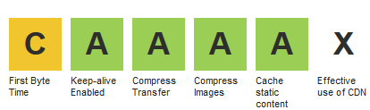
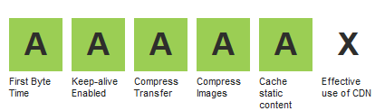
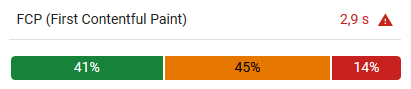
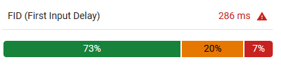
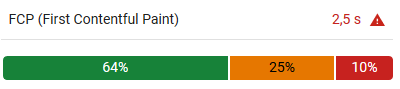

# Web caching rules used at InstantLuxe.com

By simply following best practices and using good open source tools, not necessarily costly services, here is what you could achieve:

above: WebPageTest score for the homepage (mobile)

above: WebPageTest score for the homepage (desktop)

We can reach several thousand users at the same time without a notable slowdown, which is well beyond our usual usage. Since our users are mostly located in France, our servers are there as well and we don’t have much use for a CDN (yet). Likewise, we don’t use serverless or a load balancing system, this is served by a only few dedicated servers with simple roles.

Another view is reported by PageSpeed Insights with Chrome UX Report (November 12th, 2018):

Mobile:

Desktop:

What follows can be seen a set of guidelines, tips and tricks that we have used to improve the technical performance of our website. It may or may not apply to anyone else, or have the same results if you do.

Modern image optimisation tutorials on the web tend to use JavaScript as a base tech in their tooling. We have been to use Bash for the most part. To follow along, you will need to be able to install new software on a machine. Since we are talking about web performance, a web server is required as well (examples are provided for both **httpd** and **nginx**).
